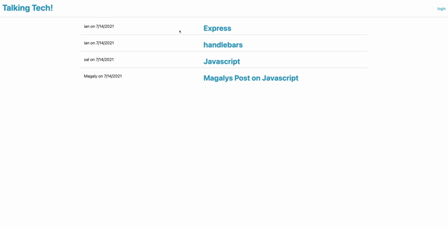

# techblogexample
<br>

  [](https://opensource.org/licenses/MIT) 
  <br>

  # Table of Contents
  - [Description](#Description)
  - [Installation](#Installation)
  - [Usage](#Usage)
  - [Contributing](#Contributing)
  - [License and Copyright](#License-and-Copyright)
  - [Citations](#Citations)
  - [Questions](#Questions)
  
  # Description
  
This application is a technology blog, allows for creation and maintenance of user accounts, posts, and comments.  It is structured to limit the ability to post or comment to logged in users.<br>
   <br>
  
  # Installation
  
  In order to install this application, the user will need to download associated files, and be sure to install nodeJS on their machine.  If they wish to install on their local machine the user will also need to install MySql, create an instance and ensure it is running on their machine.  Online deployment would require the use of heroku and jawsDB.  There is a database schema that can be used to create the database.  The user will need to navigate to the directory in their terminal and run the command ```npm install``` to install the correct nodeJS packages.  The user will need to create a .env file containing appropriate values for the variables outlined in the .env.example file included in the directory if installing locally.<br>
  
  # Usage
  
The user will need to navigate to the URL for the application as installed.  A link to the deployed application is provided below. <br>
[Deployed Application on Heroku](<https://talkintechblog.herokuapp.com/>)
  
  # Contributing
  
  Please reach out via the links in the contact section about contributing<br>
  
  # Tests
  
  please reach out via the contact links regarding testing <br>
  
  # License and Copyright
  
  Copyright 2021 Ian Hennessey
  
  <br>

  
      Permission is hereby granted, free of charge, to any person obtaining a copy of this software and associated documentation files (the "Software"), to deal in the Software without restriction, including without limitation the rights to use, copy, modify, merge, publish, distribute, sublicense, and/or sell copies of the Software, and to permit persons to whom the Software is furnished to do so, subject to the following conditions:
      
      The above copyright notice and this permission notice shall be included in all copies or substantial portions of the Software.
      
      THE SOFTWARE IS PROVIDED "AS IS", WITHOUT WARRANTY OF ANY KIND, EXPRESS OR IMPLIED, INCLUDING BUT NOT LIMITED TO THE WARRANTIES OF MERCHANTABILITY, FITNESS FOR A PARTICULAR PURPOSE AND NONINFRINGEMENT. IN NO EVENT SHALL THE AUTHORS OR COPYRIGHT HOLDERS BE LIABLE FOR ANY CLAIM, DAMAGES OR OTHER LIABILITY, WHETHER IN AN ACTION OF CONTRACT, TORT OR OTHERWISE, ARISING FROM, OUT OF OR IN CONNECTION WITH THE SOFTWARE OR THE USE OR OTHER DEALINGS IN THE SOFTWARE.
      

  <br>

  [License: The MIT License](<https://opensource.org/licenses/MIT>)

  <br>

  # Citations

  nodeJS <br>
  express <br>
  MySql <br>
  Sequelize <br>
  dotenv <br>
  bcrypt<br>
  handlebars<br>
  
  # Questions?
  Please reach out to Ian Hennessey using the contact options below: <br>
  [GitHub Profile](<https://github.com/atleastitsanethosman>)<br>
  [Email](<mailto:ian.hennessey@gmail.com>)
